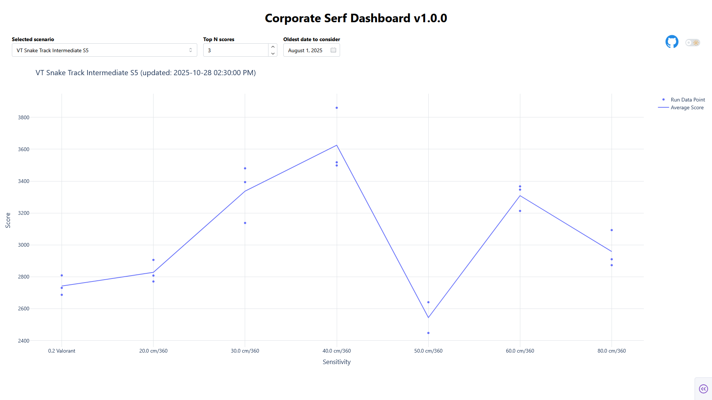

# Corporate Serf Dashboard

The name of this app is in honor of [Corporate Serf](https://www.youtube.com/watch?v=a-MShVYe3kY).

This app scans your Kovaak's Stats directory, and builds a plot of the given scenario, plotting Sensitivity vs Score. As
you keep playing and generating new scores, the plot will automatically update in the background.

## Tech Stack

1. Python
2. Dash
    1. Plotly.js
    2. Dash Mantine Components
    3. React
    4. Flask

## First Time Setup

1. Make a copy of the `example.toml`. Name the new file `config.toml`.
2. Inside `config.toml`, update the `stats_dir` variable to point to your Kovaak's stats file directory.
3. Feel free to change any other settings inside the TOML file, or leave them at their defaults.

## Usage

1. Run the app in your terminal:

```
uv sync
uv run python source/app.py
```

2. Open a browser and navigate to: http://localhost:8080/

## Example


