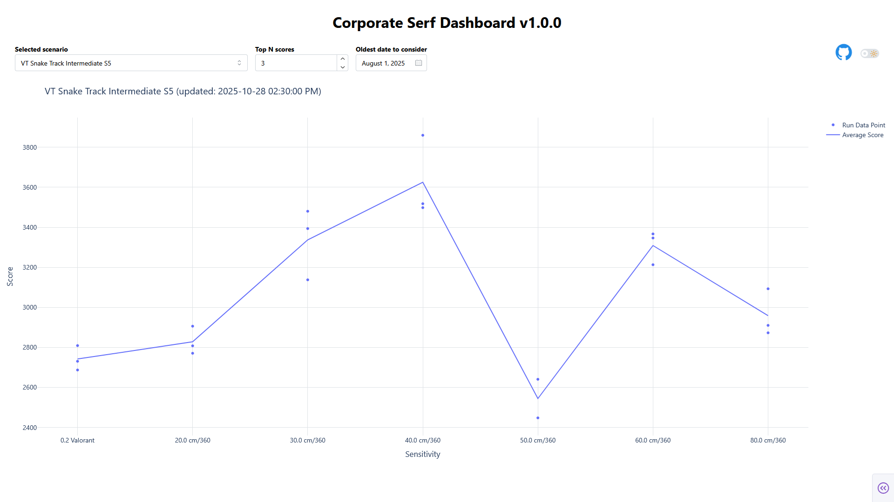

# Corporate Serf Dashboard

The name of this app is in honor of [Corporate Serf](https://www.youtube.com/watch?v=a-MShVYe3kY).

This app watches your KovaaK's stats directory and turns your runs into training insight. As you keep
playing and generating new scores, everything updates automatically in the background.

## Features

- **Scenario plots** — Sensitivity vs Score and score-over-time plots per scenario, with optional
  high-score, score-threshold, and benchmark-rank overlays.
- **Run notifications** — toasts as each run lands: top-N placements for the current scenario, and
  score-threshold pass/fail against your high score.
- **Leaderboard standing** — your global rank and percentile for the selected scenario, e.g.
  `Rank: 11,290 of 63,892 (82.33% Percentile)`, kept consistent after new personal bests.
- **Playlist scenarios table** — every scenario in a playlist with rank, percentile, last played,
  runs, high score, and personal-best stats; sort by percentile to build a training priority list.

The rationale behind each feature lives in [docs/product.md](docs/product.md); what's next in
[docs/roadmap.md](docs/roadmap.md).

## Tech Stack

1. Python
2. Dash
    1. Plotly.js
    2. Dash Mantine Components
    3. React
    4. Flask

## First Time Setup

1. Make a copy of the `example.toml`. Name the new file `config.toml`.
2. Inside `config.toml`, update the `stats_dir` variable to point to your KovaaK's stats file directory.
3. To enable the leaderboard rank features, set `kovaaks_username` (and optionally `steam_id`, which
   makes player matching exact when usernames are ambiguous). Leave it empty to run fully offline.
4. Feel free to change any other settings inside the TOML file, or leave them at their defaults. If
   something on your machine already uses port 8080 (Steam, for example), change `port`.

## Usage

Step 1: Run the app in your terminal:

```shell
uv sync
uv run python source/app.py
```

Step 2: Open a browser and navigate to: <http://localhost:8080/> (or your configured port).

## Example



## Rank Data

In essence, "benchmarks" are basically just "playlists" but with rank data attached. With the help of
the <http://Evxl.app>'s author, I combined his benchmarks data with playlist data from KovaaK's API, for most of the
common benchmarks. These files are in `resources/playlists/generated`. If you wish to include a specific benchmark into
the app, then simply copy the desired JSON file from `resources/playlists/generated` to `resources/playlists`. Then
restart the app.

## Import Playlist

In the `Settings` modal, there is an option to import a playlist via share code. The app queries the
KovaaK's API with your input share code to retrieve the playlist data.

Note that by importing playlists this way, the playlist will not include rank data. If you want to include rank data for
the rank overlays, then see the **Rank Data** section.
