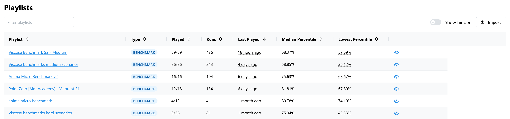
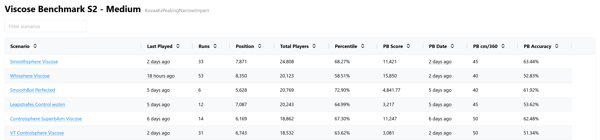

# Corporate Serf Dashboard

Charts your KovaaK's history and each new run as you play, so you can see whether you're
improving, where you're weak, and what to train next.

[Install](#install) · [Features](#features) · [User guide](docs/user_guide.md) · [Troubleshooting](#troubleshooting)

The name of this app is in honor of [Corporate Serf](https://www.youtube.com/watch?v=a-MShVYe3kY).


## Features

- **Scenario plots**: Score vs Sensitivity and Score vs Time per scenario, with PB, score-threshold,
  and benchmark-rank overlays.
- **Run notifications**: a toast to compare your new run against your personal best.
- **Personal best celebration**: confetti, fireworks, cannons, or stars when a run beats your
  scenario best.
- **Leaderboard standing**: your global position and percentile per scenario, refreshed after a new
  personal best.
- **Playlist scenarios table**: every scenario in a playlist with position, percentile, and
  personal-best stats; sort by percentile to pick what to train.
- **Benchmarks**: a bundled benchmark library, Voltaic and Viscose on by default, plus import of any
  playlist by share code; see [Playlists and Benchmarks](docs/user_guide.md#playlists-and-benchmarks).

See what's next in
[docs/roadmap.md](docs/roadmap.md).





## Install

Windows only.

1. Paste this into PowerShell:

   ```powershell
   irm https://raw.githubusercontent.com/MingoDynasty/Corporate-Serf-Dashboard/main/get.ps1 | iex
   ```

2. Double-click the **Corporate Serf Dashboard** shortcut the installer put on your desktop. A
   console window opens, the dashboard starts, and your browser opens it at
   <http://localhost:8050/>. **Closing that console window stops the dashboard**.
   Double-clicking the shortcut while it is already running opens another browser tab.

3. On its first start the dashboard finds your KovaaK's stats folder through Steam. If it
   can't, a card on the Scenario Performance page says so and sends you to Settings to set it.

4. The same page then offers to add your KovaaK's account, which turns on leaderboard
   positions and percentiles. You can skip it and add it in Settings later.

### Updates

Each launch checks for a new release and updates itself before starting. If that check fails,
for example because you're offline, it runs the version you already have.

### Other ways to install

If you'd rather not pipe a script from the internet, use
[Manual install](docs/user_guide.md#manual-install) instead. It also covers rolling back to an
older version.

Or [run from source](#run-from-source).

### Uninstall

Delete the `%LOCALAPPDATA%\CorporateSerfDashboard` folder and the desktop
shortcut. Apart from the installer script below, the install changed nothing else on your PC.

<details>
<summary>One loose end: the installer script left in <code>%TEMP%</code></summary>

The easy install downloads the installer to `%TEMP%\csd-install-<tag>.ps1` and
leaves it there. Windows clears `%TEMP%` eventually, but you can delete it yourself:

```powershell
Remove-Item "$env:TEMP\csd-install-*.ps1"
```

</details>

## What it talks to

The dashboard does not collect or send usage or crash analytics. Your runs, settings, and
caches stay on your PC unless you share a chart yourself. Three things reach the network:
installing and updating it, leaderboard lookups once a KovaaK's username is set, and the
actions you click (detecting your accounts, importing a playlist, sharing a chart).
[What it talks to](docs/user_guide.md#what-it-talks-to) in the user guide lists every service
and what makes the app reach it.

## Troubleshooting

[Troubleshooting](docs/user_guide.md#troubleshooting) in the user guide lists problems by what
you see, such as a port already in use, a stats folder that was not found, a missing
leaderboard position, or a slow first start. An installed copy keeps its logs in
`%LOCALAPPDATA%\CorporateSerfDashboard\data\logs`; a source checkout keeps them in its own
`data\logs`.

## Found a bug?

The **Settings** page has a "Report a bug" link that opens the
form with your version already filled in, and shows the folder your logs are
in.

Or open an issue from the
[issue chooser](https://github.com/MingoDynasty/Corporate-Serf-Dashboard/issues/new/choose).
The bug form says which logs to attach and what they contain.

## Configuration

Most settings live on the dashboard's own **Settings** page: where your KovaaK's stats live,
and who you are on the leaderboards. Boot settings such as `port` live in `config.toml`
(installed: `%LOCALAPPDATA%\CorporateSerfDashboard\config.toml`).
[Configuration](docs/user_guide.md#configuration) in the user guide covers both.

## Run From Source

Run from a git checkout if you want to help develop the app, or if you would rather manage the
toolchain yourself. You need git and [uv](https://docs.astral.sh/uv/):

```shell
git clone https://github.com/MingoDynasty/Corporate-Serf-Dashboard.git
cd Corporate-Serf-Dashboard
uv sync
```

Copy `example.toml` to `config.toml`, then start the app:

```shell
uv run python source/app.py
```

## Development

The app is Python + [Dash](https://dash.plotly.com/) (Plotly, Dash Mantine Components). See the
documentation in [docs/](docs/).

This app is built with AI coding agents. Every change is reviewed and must pass the tests
and CI before it merges.

## License

Copyright (C) 2025-2026 MingoDynasty

Corporate Serf Dashboard is free software under the
[GNU Affero General Public License](LICENSE), version 3 or (at your option)
any later version. Derivatives stay free and open source on the same terms.
