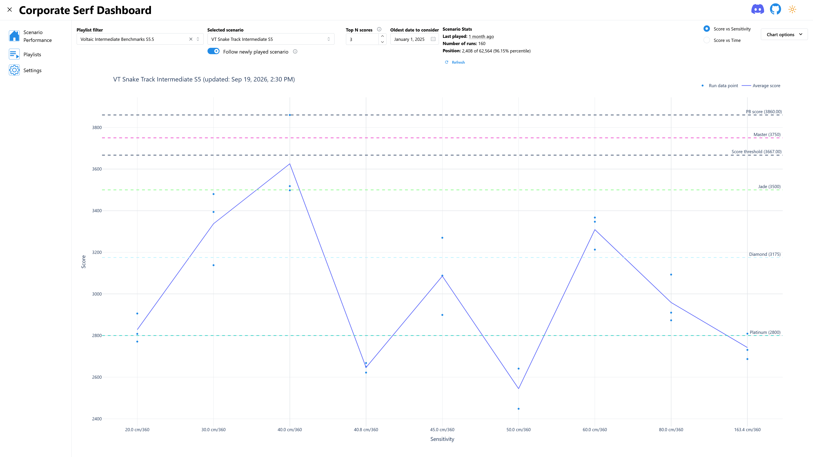

# Corporate Serf Dashboard

The name of this app is in honor of [Corporate Serf](https://www.youtube.com/watch?v=a-MShVYe3kY).

This app watches your KovaaK's stats directory and turns your runs into training insight. As you keep
playing and generating new scores, the Scenario Performance page's plots, stats, and
notifications update automatically in the background.



## Features

- **Scenario plots** — Sensitivity vs Score and score-over-time plots per scenario, with optional
  PB-score, score-threshold, and benchmark-rank overlays.
- **Run notifications** — one toast as each run lands, titled with its verdict: score-threshold
  pass/fail against your personal best, or the top-N placement it earned. Playing again replaces
  it rather than stacking a second one beside it, and a run that earns neither says nothing.
- **Leaderboard standing** — your global position and percentile for the selected scenario, e.g.
  `Position: 11,290 of 63,892 (82.33% Percentile)`, with a bounded background refresh after a new
  personal best and a manual Refresh button for when the leaderboard lags.
- **Playlist scenarios table** — every scenario in a playlist with position, percentile, last
  played, runs, and personal-best stats (PB Score, PB Date, PB cm/360, PB Accuracy); sort by
  percentile to build a training priority list.

The rationale behind each feature lives in [docs/product.md](docs/product.md); what's next in
[docs/roadmap.md](docs/roadmap.md).

## Install

Windows only. You do not need Python, uv, or git — the installer brings its own
copy of everything.

### Easy install

Paste this into PowerShell:

```powershell
irm https://raw.githubusercontent.com/MingoDynasty/Corporate-Serf-Dashboard/main/get.ps1 | iex
```

Everything lands under `%LOCALAPPDATA%\CorporateSerfDashboard` — its own uv, its
own Python, its own package cache — so nothing else on your machine is used or
disturbed. It asks you nothing. Along the way the installer:

- writes a starter `config.toml` beside the install;
- creates a **Corporate Serf Dashboard** desktop shortcut — launching is covered
  in [Usage](#usage).

On its first start the dashboard looks for your KovaaK's stats folder itself,
through Steam, and remembers what it finds. If it comes up empty — KovaaK's
installed somewhere unusual, or not installed yet — the dashboard still starts;
it simply has no runs to show and says so on the Scenario Performance page
until you point it at the folder on the Settings page (see
[Configuration](#configuration)). That same page offers the one thing the
first start cannot work out for itself — your KovaaK's account, which turns
leaderboard positions and percentiles on. Skipping the offer leaves those
features off and the dashboard does not ask again.

**Each launch checks for a new release and updates itself** before starting, so
you stay current without doing anything. If that check fails — offline, GitHub
unreachable — it simply runs the version you already have. A new version only
becomes the recorded install after it has actually started successfully; one
that fails to start is discarded and the previous version runs instead.

### Manual install

If you would rather not pipe a script from the internet, install from a release
you have inspected yourself:

1. Download the latest release zip from the
   [Releases page](https://github.com/MingoDynasty/Corporate-Serf-Dashboard/releases/latest).
2. Extract it and read `install.ps1` — it is the same installer the one-liner
   runs.
3. Open PowerShell in the extracted folder and run:

```powershell
powershell.exe -NoProfile -ExecutionPolicy Bypass -File .\install.ps1
```

That explicit command is required: double-clicking a `.ps1` file deliberately
does not execute it on Windows. `-ExecutionPolicy Bypass` relaxes only the
per-process default for this one script — it does not, and cannot, override
enterprise Group Policy or AppLocker. Home machines are the audience here; on a
machine someone else administers, ask them first.

<details>
<summary><strong>Rollback</strong> — go back to (and pin) an older release</summary>

Every release is kept and immutable, so going back is a matter of naming a tag.
Pick one from the
[Releases page](https://github.com/MingoDynasty/Corporate-Serf-Dashboard/releases),
then paste this into PowerShell, editing the first line:

```powershell
$tag = 'v2026.07.19.4'
$installer = "$env:TEMP\csd-install-$tag.ps1"
Invoke-WebRequest -UseBasicParsing -OutFile $installer `
  -Uri "https://raw.githubusercontent.com/MingoDynasty/Corporate-Serf-Dashboard/$tag/install.ps1"
powershell.exe -NoProfile -ExecutionPolicy Bypass -File $installer -Tag $tag
Remove-Item $installer
```

Each release ships its own installer, so this deliberately fetches the one
belonging to the release you are rolling back to.

`-Tag` also **pins** the install: it stays on that version and stops
auto-updating. Without the pin, the next launch would immediately reinstall the
release you just rolled back from, making the rollback a no-op. To resume
automatic updates, run the [easy install](#easy-install) one-liner again.

Releases published before the installer existed cannot be rolled back to;
`v2026.07.19.4` is the earliest that can.

Rolling back has a config floor too. Because `config.toml` is written once at
first install and never rewritten, an install first set up by a release that
omits `polling_interval` and `sens_round_decimal_places` (they now default in
code) cannot roll back to an older release that still requires them — the
install stops with a "cannot load config.toml" error. Add those two keys from
`example.toml`, or delete `config.toml` so the older installer regenerates its
own, then re-run.

</details>

### Uninstall

Delete the `%LOCALAPPDATA%\CorporateSerfDashboard` folder and the desktop
shortcut. Nothing else on the machine was modified — no registry keys, no
machine-wide Python or uv, nothing on `PATH`.

<details>
<summary>One loose end: the installer script left in <code>%TEMP%</code></summary>

The easy install downloads the installer to `%TEMP%\csd-install-<tag>.ps1` and
leaves it there. It is inert once the install finishes — nothing reads it again
— and Windows clears `%TEMP%` eventually, but you can delete it yourself:

```powershell
Remove-Item "$env:TEMP\csd-install-*.ps1"
```

</details>

## Configuration

Two files sit side by side. `config.toml` holds boot settings and is yours to
edit:

- **Installed:** `%LOCALAPPDATA%\CorporateSerfDashboard\config.toml`, written on
  first install. Updates never touch it.
- **From source:** copy `example.toml` to `config.toml` in your checkout.

`example.toml` documents every setting; one is worth knowing about:

- `port` — change this if something else on your machine already uses 8050. The
  dashboard says so at startup rather than failing mysteriously.

Everything else you might want to change lives on the dashboard's own
**Settings** page: where your KovaaK's stats live, and who you are on the
leaderboards. The stats folder is usually filled in for you on the first start
— the dashboard finds it through Steam — so the page is mostly there for the
cases it could not, and for turning the leaderboard features on. If you have
KovaaK's in more than one Steam library, the stats folder box suggests each one
it found, so picking the right copy is a click rather than a hunt through
Explorer. For the username and Steam ID, **Detect** checks the Steam accounts
on this machine against KovaaK's and fills in the one it can prove is yours —
or lists what it found, for you to choose from, when it cannot be sure of
exactly one. Nothing detected is kept until you press Save.

The page writes `data/settings.json`, the app-owned file beside `config.toml`
(installed: `%LOCALAPPDATA%\CorporateSerfDashboard\data\settings.json`). You
can write it by hand instead:

```json
{
  "stats_dir": "S:/SteamLibrary/steamapps/common/FPSAimTrainer/FPSAimTrainer/stats",
  "kovaaks_username": "YourKovaaksName",
  "steam_id": ""
}
```

- `stats_dir` — the folder KovaaK's writes its run files into, usually
  `<Steam library>/steamapps/common/FPSAimTrainer/FPSAimTrainer/stats`. Without
  it the dashboard still starts, but it has no runs to show and says so on the
  Scenario Performance page. Left empty on purpose, it stays empty: the startup
  detection only fills the value in when it has never been set.
- `kovaaks_username` — enables the leaderboard position and percentile features;
  leave it out to run fully offline. `steam_id` is optional and makes player
  matching exact when usernames are ambiguous.

Edit this file only while the dashboard is stopped — it is read once per run.
Saving from the Settings page while it runs is fine; the page tells you when a
change needs a restart before it takes effect.

## Usage

Launch from the desktop shortcut, which opens the dashboard in your browser —
or run it from a source checkout (below) and open <http://localhost:8050/>, or
your configured port. When launched from the shortcut, a console window stays
open while the dashboard is running — **closing it stops the dashboard**, which
is how you shut it down. Double-clicking the shortcut again while it is already
running just opens another browser tab; it will not start a second copy.

Use one active Scenario Performance tab at a time. Additional ones are
crash-safe, but they share one in-memory run-event queue and are not
synchronized with each other.

## Playlists and Benchmarks

Benchmarks are playlists with rank data attached. The app ships with a bundled
benchmark library in `resources/benchmarks` — built with the help of
[Evxl.app](https://evxl.app)'s author by combining his benchmark rank data with
playlist data from the KovaaK's API — and loads all of it at startup. The most
popular benchmarks (Voltaic, Viscose) are visible by default; to enable any
other, toggle "Show hidden" on the Playlists page and unhide it — no file
copying needed.

You can also import any playlist by share code: on the Playlists page, click
**Import** and enter the code, and the app fetches the playlist from the
KovaaK's API and saves it under `data/playlists`. Playlists imported this way
carry no rank data — the benchmark-rank overlays come only from the bundled
library.

## Found a bug?

Open an issue from the
[issue chooser](https://github.com/MingoDynasty/Corporate-Serf-Dashboard/issues/new/choose)
— there is a form for bug reports and one for feature requests. The bug form
asks for your app version and your `debug.log`, which is what makes a failure
on a machine no one else can see diagnosable; it also spells out what the log
contains before you attach it.

Easiest route: the **Settings** page has a "Report a bug" link that opens the
form with your version already filled in, and shows the folder your logs are
in.

## Run From Source

For development, or if you would rather manage the toolchain yourself. The app
is Python + [Dash](https://dash.plotly.com/) (Plotly, Dash Mantine Components);
[docs/architecture.md](docs/architecture.md) has the module map. Requires git
and [uv](https://docs.astral.sh/uv/):

```shell
git clone https://github.com/MingoDynasty/Corporate-Serf-Dashboard.git
cd Corporate-Serf-Dashboard
uv sync
```

Copy `example.toml` to `config.toml`, then start the app — the stats folder is
detected on the first start, and the Settings page covers whatever it missed
(see [Configuration](#configuration)):

```shell
uv run python source/app.py
```

A source checkout does not auto-update; `git pull` is the update path.
