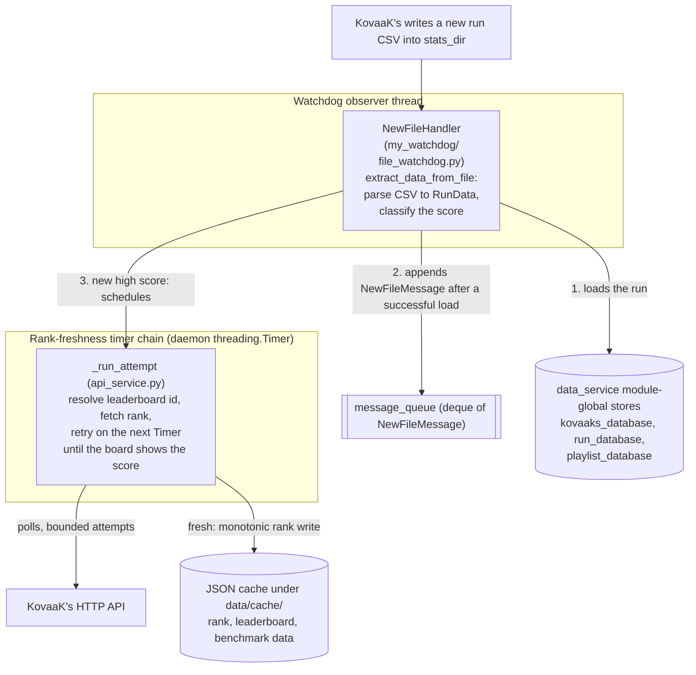
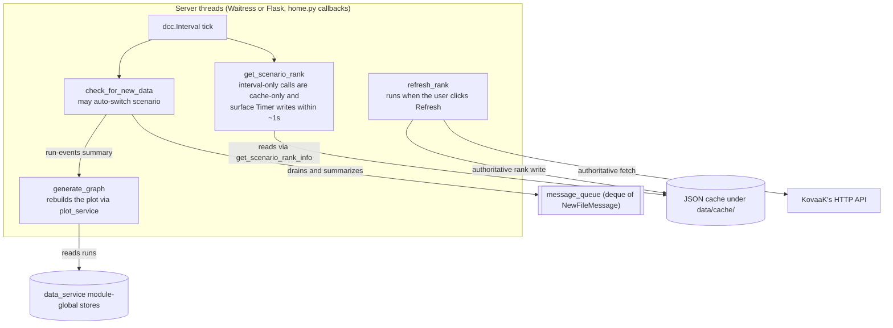
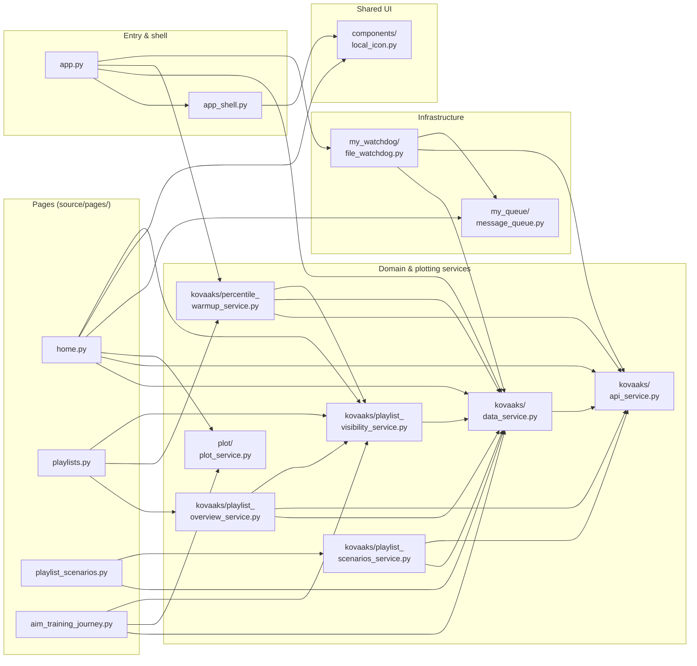

# Architecture

A map of the codebase: what each module owns and how data moves at runtime.
This is the "where does X live" index so you don't have to re-read the tree.

For the *why* behind specific choices, see `docs/decision_log.md`; for KovaaK's
endpoint behavior see `docs/kovaaks_api_notes.md`; for workflow/conventions see
`AGENTS.md`. This file intentionally does not restate those.

## Process & threads

`source/app.py` (`main`) loads config, calls `initialize_kovaaks_data` to build
the in-memory stores from existing CSVs, starts a watchdog `Observer` on
`stats_dir`, and serves the Dash app with Waitress (Flask dev server when
`config.debug`).

Threads at runtime:

- **Server thread(s)** — Waitress (8 workers) or Flask serving Dash; runs the
  page callbacks.
- **Watchdog observer thread** — `NewFileHandler` fires on each new CSV.
- **Rank freshness timers** — after a new high score, `api_service.py` uses a
  bounded chain of daemon `threading.Timer` attempts to poll until KovaaK's
  leaderboard reflects the local score.
- **Percentile warmup worker** — one daemon thread fills stale rank/total
  caches for played scenarios in visible playlists, yields to recent
  interactive activity, and blocks on a condition variable when idle.
- KovaaK's GETs use a **thread-local `requests.Session`**; cache file I/O is
  guarded by a single `threading.RLock` (`_CACHE_IO_LOCK` in `api_service.py`).

## Runtime data flow

Two halves of one flow, split for readability; the `message_queue`,
`data_service` stores, and JSON cache nodes are the shared state where they
meet. Each arrow is an action performed by its source node.

Ingest — the watchdog side (writes):

UI — the server side (pull-based reads):

The watchdog and UI share two channels: `message_queue` (a `deque`) carries
*notifications* that new data exists, while the run data itself is shared through
the `data_service.py` module-global stores the UI reads directly. Note the order
above — the run is loaded into the stores before its message becomes visible.
The UI is pull-based: a `dcc.Interval` on the home page drains the entire queue
each tick and publishes one scenario-specific summary. `generate_graph` reads
that summary and never accesses the queue directly.

## State

- **Two filesystem roots** (`utilities/paths.py`). Every mutable path below is
  relative to the **state root**: `config.toml` and everything under `data/`.
  It is `CSD_STATE_DIR` when set (the launcher owns that variable; the app only
  reads it) and the current working directory otherwise, so a dev checkout
  behaves exactly as it always has. Read-only assets that ship with the code —
  `resources/benchmarks/` — resolve against the **package root** instead
  (derived from `__file__`), because a deployed install runs code from a
  per-version directory while state lives at the install root.
- **In-memory only, no database.** `data_service.py` holds the live stores as
  module globals, rebuilt from CSVs on every startup:
  - `kovaaks_database` — scenario stats keyed by scenario name
  - `run_database` — a `SortedList` of all runs ordered by time
  - `playlist_database` — loaded playlists keyed by code. Startup loads
    top-level JSON files from the bundled `resources/benchmarks/` library
    (all of it — visibility, not file presence, decides what users see) and user
    `data/playlists/` second; the first file for a code wins, duplicate-code
    files warn visibly after the UI mounts, and a missing user root is treated
    as empty. New imports are written atomically under `data/playlists/`.
- **Cache layer** — KovaaK's API responses and resolved rank/leaderboard data
  persist as JSON under `data/cache/` (not committed), written atomically and
  read tolerantly. Subtrees include `scenario_leaderboards/`,
  `user_scenario_total_play/`, `leaderboard/totals/`, `benchmarks/`, and
  per-scenario rank files. TTLs and rationale live in `docs/decision_log.md`.
- **Playlist visibility** — `data/playlist_visibility.json` (not committed)
  holds the playlist show-list (`playlist_visibility_service.py`): written
  atomically on each show/hide, read once and cached in-process, absent until
  the first show/hide (reads fall back to the first-run seed).

## Module map

Import dependencies between the main modules. `config/config_service.py` and
`utilities/` are imported nearly everywhere and are omitted; the subsections
below carry the per-module detail.

### Entry & shell
- `source/app.py` — entry point (`main`): wiring described above.
- `source/app_shell.py` — top-level layout (`layout`): navbar (`nav_link`; burger
  collapse applied by a clientside callback), theme toggle, Dash `page_container`,
  and the notification host.

### Pages (`source/pages/`, Dash Pages — one file per route)
- `home.py` (`/`) — main scenario view: sensitivity/time plots, high score, rank,
  settings modal. Owns the live-update callbacks
  (`check_for_new_data` drains `message_queue`; `generate_graph` consumes the
  resulting `run-events` summary).
- `playlists.py` (`/playlists`) — playlist-level overview (AG Grid): one row
  per visible playlist with coverage, runs, last-played, and cached-percentile
  aggregates; any cell click navigates to that playlist's scenario table.
  Overview row rendering is local-only — it draws from local run data and rank
  caches and never triggers KovaaK's API calls. While the warmup worker is
  busy, a one-second interval rebuilds those rows with activity recording
  suppressed, shows remaining/ETA or paused/fatal state, and disables after a
  final idle rebuild. One callback snapshots worker state, rebuilds rows, then
  returns the rows and interval state together; an idle snapshot therefore
  precedes the final cache read and cannot race it. That callback tracks the
  worker's enqueue generation, and the shared row-refresh store re-arms it
  after idle.
  Also hosts the visibility controls: a per-row Hide/Unhide action cell and a
  "Show hidden" toggle that reveals hidden playlists as muted rows. Unhide
  prepends the playlist's played scenarios to warmup before bumping that
  refresh store. Hosts playlist import (share-code
  modal) — the one networked action on this page: `load_playlist_from_code`
  calls the API, and on success a refresh store bump rebuilds the grid with the
  new visible row without a page reload and re-arms any enqueued warmup work.
  Hosts playlist deletion: a per-row
  Delete action cell (user playlists only; bundled rows render nothing) opens a
  confirmation modal, then `delete_user_playlist` unlinks the file and the same
  refresh store rebuilds the grid. When the loader recorded user files
  superseded by bundled benchmarks, an alert above the grid offers a one-click
  cleanup (`delete_superseded_user_playlist_files`).
- `playlist_scenarios.py` (`/playlists/<playlist_code>`) — per-playlist scenario
  overview (AG Grid). `load_playlist_scenario_rows` is driven by a layout-bound
  mounted-route store, not the URL directly (see decision log). It paints
  cache-only phase-1 rows, stores a per-open generation token, enables the
  fill interval, and drains complete phase-2 rows through update-only AG Grid
  transactions. The drain callback owns progress text, cancellation
  finalization, and the one-shot aggregate completion toast.
- `aim_training_journey.py` (`/aim-training-journey`) — cumulative playtime/progress plot.

### Shared UI components
- `components/local_icon.py` — local SVG icon registry/helper used by the shell
  and page controls. SVG files live under `assets/icons/` so the local app does
  not fetch Iconify icon data at runtime.

### KovaaK's domain (`source/kovaaks/`)
- `data_service.py` — in-memory data layer + CSV ingest. Key: `initialize_kovaaks_data`,
  `load_csv_file_into_database`, `extract_data_from_file`, `get_high_score`,
  `get_sensitivities_vs_runs`, and the playlist loaders/getters. `load_playlists`
  records each winning user-root code's actual file path (so deletion targets
  the real file, not a reconstructed name) and the user files it skips because
  a bundled code already won; `delete_user_playlist` and
  `delete_superseded_user_playlist_files` are the write paths that unlink those
  files under the playlist I/O lock, keeping startup itself read-only.
- `api_service.py` — KovaaK's HTTP client + rank pipeline: GET retry/session
  helpers, JSON cache helpers, leaderboard-id resolution, the cache-first/cache-only
  `get_scenario_rank_info` read path, centralized monotonic rank writes, and the
  bounded `schedule_rank_freshness_refresh` Timer poll. The stale fallback tags
  its returned `ScenarioRankInfo` structurally without persisting the marker;
  split interactive-activity/network-success timestamps coordinate the
  percentile warmup worker. UI consumes `ScenarioRankInfo` and never calls endpoints directly. See
  `docs/kovaaks_api_notes.md`.
- `percentile_warmup_service.py` — app-lifetime daemon worker for the
  played/visible percentile cache queue. It owns playlist-completion ordering,
  dequeue-time freshness/dedup, username validation before UNRANKED writes,
  direct rank/total fetch classification, outage backoff, and the read-only
  progress snapshot consumed by the overview UI.
- `playlist_scenarios_service.py` — builds cache-only first-paint rows for the
  per-playlist scenario table, then owns the generation-keyed progressive-fill
  registry, synchronous cancellation/tombstones, four-worker fill, and atomic
  interval drain. Every streamed/finalized item is a complete row merging
  freshly read local stats with rank info.
- `playlist_overview_service.py` — builds rows for the playlist-level overview
  (`build_playlist_overview_rows`): per-playlist aggregates over local stats
  plus cache-only rank reads (`get_scenario_rank_info` with
  `allow_network=False`), filtered by visibility unless the overview's "show
  hidden" mode asks for everything. Automated warmup-interval builds thread
  `record_activity=False` into those reads so polling does not postpone the
  worker.
- `playlist_visibility_service.py` — per-code show/hide visibility (plain
  show-list persisted at `data/playlist_visibility.json`, atomic writes under a
  module lock). A missing file yields the first-run seed (bundled defaults plus
  user-root codes) without writing. `get_visible_playlist_selector_options()`
  is the single visibility filter every playlist option list consumes (Home
  filter, Journey picker, overview).
- `data_models.py` — internal models (`RunData`, `ScenarioStats`, `PlaylistData`,
  `Rank`, `Scenario`).
- `api_models.py` — pydantic models for KovaaK's API responses, plus
  `ScenarioRankInfo` / `ScenarioRankStatus`.

### Plotting
- `plot/plot_service.py` — pure figure builders (`generate_sensitivity_plot`,
  `generate_time_plot`, `generate_aim_training_journey_plot`, overlays, light/dark
  theming). No I/O.

### Infrastructure
- `my_watchdog/file_watchdog.py` — `NewFileHandler`: parse new CSV, update DBs,
  push `NewFileMessage`, and schedule the bounded rank freshness poll on a new
  high score.
- `my_queue/message_queue.py` — `message_queue` (`deque[NewFileMessage]`): the
  watchdog-to-UI hand-off.
- `config/config_service.py` — loads `config.toml` into `config` (`ConfigData`).
- `health.py` — registers the `/health` Flask route on `app.server`: the
  running build's identity plus an echo of the `CSD_LAUNCH_TOKEN` environment
  variable, which is how an updater tells "my new process is up" apart from
  "something else answers on this port".
- `utilities/build_info.py` — `get_build_info()`: the single source of build
  identity (tag, commit SHA, commit date), read once per process from
  `install.json`, then the `git archive`-expanded `version.txt` stamp, then
  `git`, then `unknown`. The manifest wins only when it corroborates the
  running code (its `sha` equals the stamp's), because an install's manifest
  still names the previous version while a new one is on trial. Feeds the
  startup log line, the header tooltip, the browser title, and `/health`.
- `utilities/` — `dash_logging` (routes `logging` to on-screen Mantine
  notifications; records logged outside a callback context are queued and
  drained by a Home interval callback, so background threads can log too),
  `stopwatch`, `utilities` (`ordinal`, `format_decimal`),
  `atomic_write` (Windows-lock-tolerant `os.replace` with retry),
  `paths` (`state_dir()` / `package_root()` — see State above).
- `scripts/benchmark_importer/` — imports Evxl benchmark metadata and KovaaK's
  rank thresholds into reviewable benchmark files.

### Browser assets
- `assets/dashAgGridFunctions.js` — repo-owned client-side AG Grid functions
  (e.g. `nullsLastComparator` for NULLS-LAST sorting). Both playlist grids
  (`playlists.py`, `playlist_scenarios.py`) reference these from their column
  defs and run with `dangerously_allow_code=True`. Custom grid sort/format
  behavior belongs here — see the decision log.
- `assets/stylesheet.css` — shared semantic presentation rules, including the
  explicit pending-cell ellipsis animation used by playlist progressive fill.
- `assets/icons/` — vendored SVGs consumed by `components/local_icon.py`.

## Where to look first

| To change... | Start in |
| --- | --- |
| The live-update / auto-refresh mechanism | `pages/home.py` callbacks + `my_queue/message_queue.py` |
| CSV parsing or the in-memory stores | `kovaaks/data_service.py` |
| A KovaaK's endpoint, rank logic, or caching | `kovaaks/api_service.py` (+ `docs/kovaaks_api_notes.md`) |
| Background playlist percentile cache warming | `kovaaks/percentile_warmup_service.py` + status/interval wiring in `pages/playlists.py` |
| Any plot/figure | `plot/plot_service.py` |
| The playlist-level overview table at `/playlists` | `pages/playlists.py` + `kovaaks/playlist_overview_service.py`; client-side grid functions in `assets/dashAgGridFunctions.js`, cell renderer components in `assets/dashAgGridComponentFunctions.js` |
| Playlist show/hide visibility, or which playlists appear in dropdowns | `kovaaks/playlist_visibility_service.py` (+ the overview page's visibility controls in `pages/playlists.py`) |
| The per-playlist scenario table, or its column sorting/formatting | `pages/playlist_scenarios.py` + `kovaaks/playlist_scenarios_service.py`; client-side grid functions in `assets/dashAgGridFunctions.js` |
| Navbar, theme, or page chrome | `source/app_shell.py` |
| Shared UI icons or vendored SVGs | `components/local_icon.py` + `assets/icons/` |
| Config / settings | `config/config_service.py` (+ `example.toml`) |
