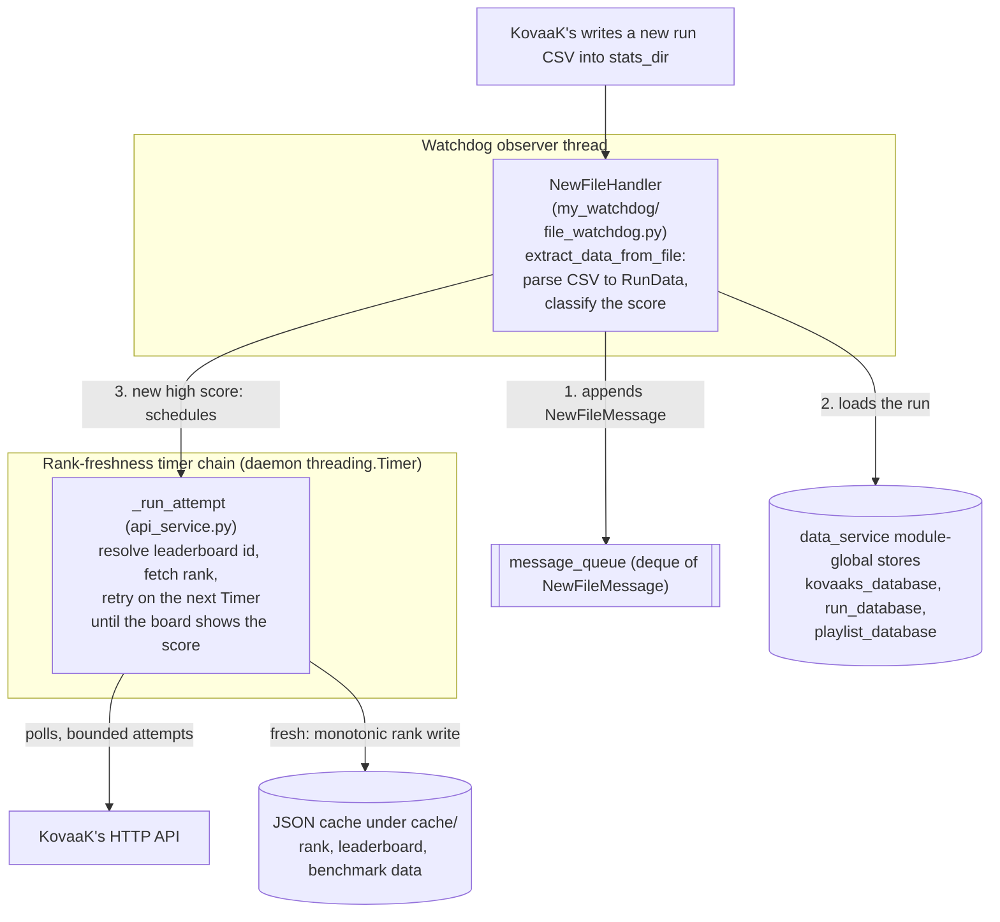
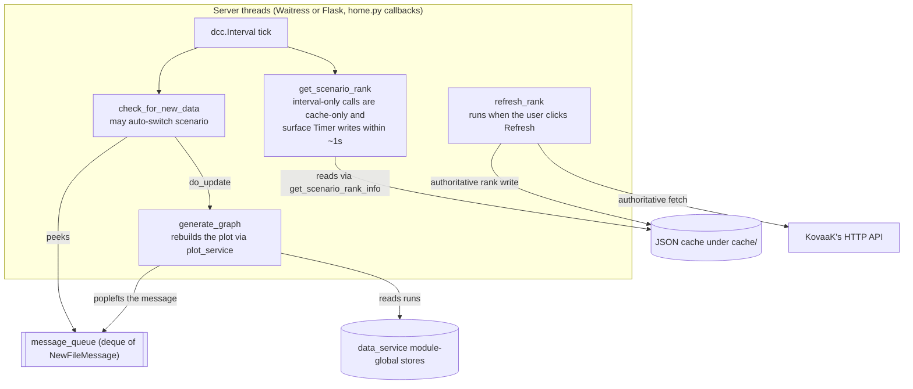
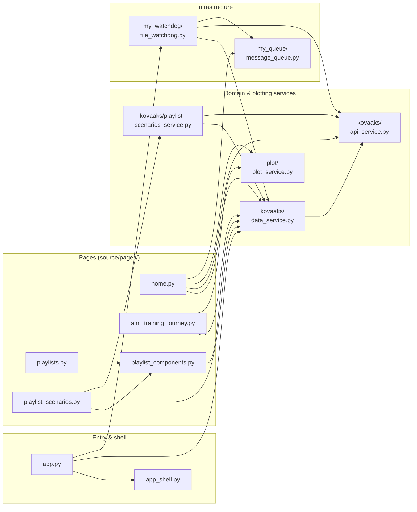

# Architecture

A map of the codebase: what each module owns and how data moves at runtime.
This is the "where does X live" index so you don't have to re-read the tree.

For the *why* behind specific choices, see `docs/decision_log.md`; for KovaaK's
endpoint behavior see `docs/kovaaks_api_notes.md`; for workflow/conventions see
`AGENTS.md`. This file intentionally does not restate those.

## Process & threads

`source/app.py` (`main`) loads config, calls `initialize_kovaaks_data` to build
the in-memory stores from existing CSVs, starts a watchdog `Observer` on
`stats_dir`, and serves the Dash app with Waitress (Flask dev server when
`config.debug`).

Threads at runtime:

- **Server thread(s)** — Waitress/Flask serving Dash; runs the page callbacks.
- **Watchdog observer thread** — `NewFileHandler` fires on each new CSV.
- **Rank freshness timers** — after a new high score, `api_service.py` uses a
  bounded chain of daemon `threading.Timer` attempts to poll until KovaaK's
  leaderboard reflects the local score.
- KovaaK's GETs use a **thread-local `requests.Session`**; cache file I/O is
  guarded by a single `threading.RLock` (`_CACHE_IO_LOCK` in `api_service.py`).

## Runtime data flow

Two halves of one flow, split for readability; the `message_queue`,
`data_service` stores, and JSON cache nodes are the shared state where they
meet. Each arrow is an action performed by its source node.

Ingest — the watchdog side (writes):

UI — the server side (pull-based reads):

The watchdog and UI share two channels: `message_queue` (a `deque`) carries
*notifications* that new data exists, while the run data itself is shared through
the `data_service.py` module-global stores the UI reads directly. Note the order
above — the message is appended *before* the run is loaded into the stores. The
UI is pull-based: a `dcc.Interval` on the home page drains the queue each tick.

## State

- **In-memory only, no database.** `data_service.py` holds the live stores as
  module globals, rebuilt from CSVs on every startup:
  - `kovaaks_database` — scenario stats keyed by scenario name
  - `run_database` — a `SortedList` of all runs ordered by time
  - `playlist_database` — loaded playlists keyed by code
- **Cache layer** — KovaaK's API responses and resolved rank/leaderboard data
  persist as JSON under `cache/` (not committed), written atomically and read
  tolerantly. Subtrees include `scenario_leaderboards/`,
  `user_scenario_total_play/`, `leaderboard/totals/`, `benchmarks/`, and
  per-scenario rank files. TTLs and rationale live in `docs/decision_log.md`.

## Module map

Import dependencies between the main modules. `config/config_service.py` and
`utilities/` are imported nearly everywhere and are omitted; the subsections
below carry the per-module detail.

### Entry & shell
- `source/app.py` — entry point (`main`): wiring described above.
- `source/app_shell.py` — top-level layout (`layout`): navbar (`nav_link`,
  `toggle_navbar`), theme toggle, Dash `page_container`, and the notification host.

### Pages (`source/pages/`, Dash Pages — one file per route)
- `home.py` (`/`) — main scenario view: sensitivity/time plots, high score, rank,
  settings modal, playlist import. Owns the live-update callbacks
  (`check_for_new_data`, `generate_graph`) that drain `message_queue`.
- `playlists.py` (`/playlists`) — playlist picker that routes to a playlist.
- `playlist_scenarios.py` (`/playlists/<playlist_code>`) — per-playlist scenario
  overview (AG Grid). `load_playlist_scenario_rows` is driven by mounted route
  state, not the selector directly (see decision log).
- `aim_training_journey.py` (`/aim-training-journey`) — cumulative playtime/progress plot.
- `playlist_components.py` — shared `playlist_selector` component.

### KovaaK's domain (`source/kovaaks/`)
- `data_service.py` — in-memory data layer + CSV ingest. Key: `initialize_kovaaks_data`,
  `load_csv_file_into_database`, `extract_data_from_file`, `get_high_score`,
  `get_sensitivities_vs_runs`, and the playlist loaders/getters.
- `api_service.py` — KovaaK's HTTP client + rank pipeline: GET retry/session
  helpers, JSON cache helpers, leaderboard-id resolution, the cache-first/cache-only
  `get_scenario_rank_info` read path, centralized monotonic rank writes, and the
  bounded `schedule_rank_freshness_refresh` Timer poll. UI consumes
  `ScenarioRankInfo` and never calls endpoints directly. See
  `docs/kovaaks_api_notes.md`.
- `playlist_scenarios_service.py` — builds rows for the playlist overview table
  (`build_playlist_scenario_rank_rows`), merging local stats with rank info.
- `data_models.py` — internal models (`RunData`, `ScenarioStats`, `PlaylistData`,
  `Rank`, `Scenario`).
- `api_models.py` — pydantic models for KovaaK's API responses, plus
  `ScenarioRankInfo` / `ScenarioRankStatus`.

### Plotting
- `plot/plot_service.py` — pure figure builders (`generate_sensitivity_plot`,
  `generate_time_plot`, `generate_aim_training_journey_plot`, overlays, light/dark
  theming). No I/O.

### Infrastructure
- `my_watchdog/file_watchdog.py` — `NewFileHandler`: parse new CSV, update DBs,
  push `NewFileMessage`, and schedule the bounded rank freshness poll on a new
  high score.
- `my_queue/message_queue.py` — `message_queue` (`deque[NewFileMessage]`): the
  watchdog-to-UI hand-off.
- `config/config_service.py` — loads `config.toml` into `config` (`ConfigData`).
- `utilities/` — `dash_logging` (routes `logging` to on-screen Mantine
  notifications), `stopwatch`, `utilities` (`ordinal`, `format_decimal`).
- `scripts/benchmark_importer/` — imports Evxl benchmark metadata and KovaaK's
  rank thresholds into reviewable benchmark files.

### Browser assets
- `assets/dashAgGridFunctions.js` — repo-owned client-side AG Grid functions
  (e.g. `nullsLastComparator` for NULLS-LAST sorting). The playlist overview grid
  references these from its column defs and runs with `dangerously_allow_code=True`
  in `playlist_scenarios.py`. Custom grid sort/format behavior belongs here — see
  the decision log.

## Where to look first

| To change... | Start in |
| --- | --- |
| The live-update / auto-refresh mechanism | `pages/home.py` callbacks + `my_queue/message_queue.py` |
| CSV parsing or the in-memory stores | `kovaaks/data_service.py` |
| A KovaaK's endpoint, rank logic, or caching | `kovaaks/api_service.py` (+ `docs/kovaaks_api_notes.md`) |
| Any plot/figure | `plot/plot_service.py` |
| The playlist overview table, or its column sorting/formatting | `pages/playlist_scenarios.py` + `kovaaks/playlist_scenarios_service.py`; client-side grid functions in `assets/dashAgGridFunctions.js` |
| Navbar, theme, or page chrome | `source/app_shell.py` |
| Config / settings | `config/config_service.py` (+ `example.toml`) |
