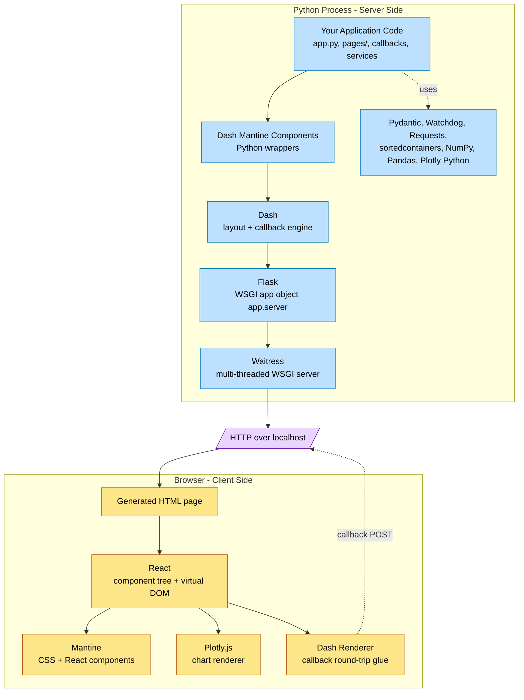
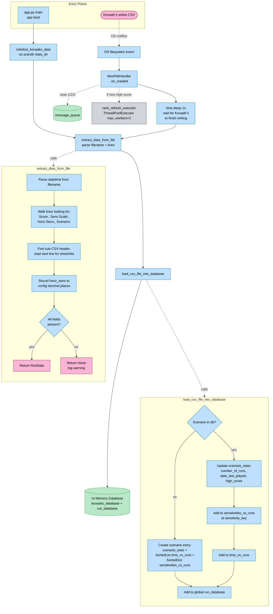
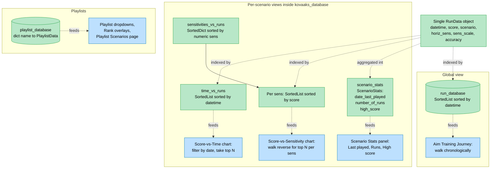
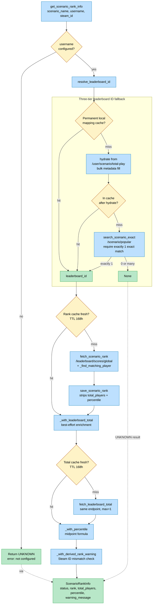
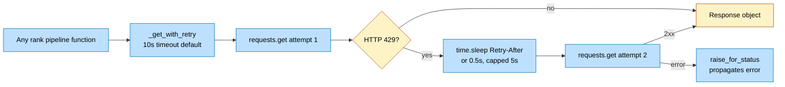
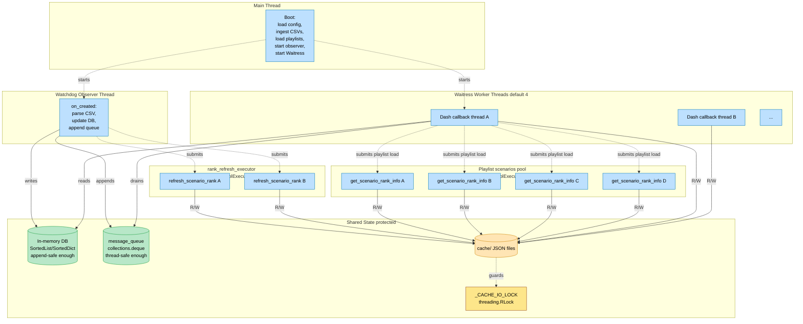
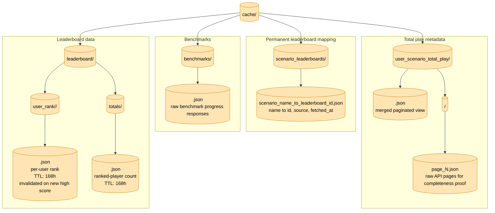

# Corporate Serf Dashboard — System Diagrams

A living visual reference of how the system fits together. Companion to `research.md` (the comprehensive write-up) and `analysis.md` (the topic-by-topic walkthrough).

All diagrams use [Mermaid](https://mermaid-js.github.io/), which Obsidian renders natively. Edit any diagram by changing the code inside the ```` ```mermaid ```` blocks.

## Contents

1. **High-level system overview** — every major piece in one picture.
2. **Tech stack layers** — what's running where.
3. **CSV ingestion pipeline** — how data gets into the in-memory database.
4. **In-memory database shape** — the four sorted views.
5. **Rank lookup pipeline** — the three-tier fallback and caches.
6. **Concurrency / thread model** — who's running on which thread.
7. **Cache layout on disk** — what lives under `cache/`.

How to read the diagrams:
- **Cyan boxes** = Python code (modules, functions).
- **Yellow boxes** = on-disk state (files, caches).
- **Green boxes** = in-memory state (the database, queues).
- **Pink boxes** = external systems (browser, KovaaK's API, KovaaK's game).
- **Gray boxes** = threading primitives (locks, executors).
- **Dashed arrows** = "fires/triggers" (async).
- **Solid arrows** = "calls/reads/writes" (sync).

---

## 1. High-Level System Overview

Every major component on one page. This is the diagram to come back to whenever you want to remember *what talks to what*.

```mermaid
flowchart TB
    subgraph EXT [External Systems]
        direction LR
        BROWSER([User's Browser])
        KOVAAKS_GAME([KovaaK's Game])
        KOVAAKS_API([KovaaK's Webapp API<br/>kovaaks.com/webapp-backend])
    end

    subgraph DISK [On Disk]
        direction LR
        CONFIG[(config.toml)]
        STATS_DIR[(stats_dir/<br/>thousands of CSVs)]
        PLAYLISTS[(resources/playlists/<br/>*.json)]
        CACHE[(cache/<br/>rank, totals, mappings)]
    end

    subgraph APP [Corporate Serf Dashboard Process]
        direction TB

        subgraph BOOT [Boot Phase]
            APP_PY[app.py<br/>main]
            CONFIG_SVC[config_service<br/>loads ConfigData]
            INIT_DATA[initialize_kovaaks_data<br/>bulk CSV ingest]
            INIT_PLAYLISTS[load_playlists<br/>JSON ingest]
        end

        subgraph CORE [Runtime]
            direction TB
            WAITRESS[Waitress WSGI Server<br/>127.0.0.1:8080]
            DASH[Dash App + Mantine UI]
            WATCHDOG[Watchdog Observer<br/>+ NewFileHandler]
            API_SVC[api_service<br/>rank lookup pipeline]
            DATA_SVC[data_service<br/>ingestion + queries]
            PLOT_SVC[plot_service<br/>Plotly figures]
        end

        subgraph MEM [In-Memory State]
            DB[(kovaaks_database<br/>+ run_database<br/>+ playlist_database)]
            QUEUE[(message_queue<br/>deque)]
        end
    end

    %% Boot wiring
    CONFIG -.read at startup.-> CONFIG_SVC
    STATS_DIR -.bulk scan.-> INIT_DATA
    PLAYLISTS -.read at import.-> INIT_PLAYLISTS
    INIT_DATA --> DB
    INIT_PLAYLISTS --> DB
    APP_PY --> WAITRESS
    APP_PY --> WATCHDOG

    %% Runtime flows
    BROWSER <-->|HTTP| WAITRESS
    WAITRESS --> DASH
    DASH --> DATA_SVC
    DASH --> API_SVC
    DASH --> PLOT_SVC

    KOVAAKS_GAME -.writes CSV.-> STATS_DIR
    STATS_DIR -.OS event.-> WATCHDOG
    WATCHDOG --> DATA_SVC
    WATCHDOG -.appends.-> QUEUE
    WATCHDOG -.triggers refresh.-> API_SVC

    DATA_SVC <--> DB
    API_SVC <-->|HTTP| KOVAAKS_API
    API_SVC <--> CACHE

    QUEUE -.polled by dcc.Interval.-> DASH
    DB -.read by callbacks.-> PLOT_SVC

    classDef python fill:#bde0fe,stroke:#0077b6,color:#000
    classDef disk fill:#ffe5b4,stroke:#cc8400,color:#000
    classDef mem fill:#b8e7c8,stroke:#1b9e3e,color:#000
    classDef external fill:#fbb4d5,stroke:#a4133c,color:#000
    class APP_PY,CONFIG_SVC,INIT_DATA,INIT_PLAYLISTS,WAITRESS,DASH,WATCHDOG,API_SVC,DATA_SVC,PLOT_SVC python
    class CONFIG,STATS_DIR,PLAYLISTS,CACHE disk
    class DB,QUEUE mem
    class BROWSER,KOVAAKS_GAME,KOVAAKS_API external
```

---

## 2. Tech Stack Layers

What runs where. The Python side runs in your terminal; the JavaScript side runs in the browser. Dash bridges them.



---

## 3. CSV Ingestion Pipeline

How a `.csv` file becomes a row in the in-memory database. Two entry points (bulk at startup, live via watchdog), one converging code path.



---

## 4. In-Memory Database Shape

The four parallel sorted views of the same `RunData` objects. Each view is sorted by the dimension some UI question cares about.



---

## 5. Rank Lookup Pipeline

`get_scenario_rank_info` end-to-end. Each step is best-effort and produces a stable `ScenarioRankInfo` for the UI, regardless of which paths succeed.



### The supporting HTTP layer

Every KovaaK's request flows through one wrapper that handles timeouts and 429 retries.



---

## 6. Concurrency / Thread Model

The app is multi-threaded. This diagram shows every thread that exists at runtime and what shared state they touch.



---

## 7. Cache Layout on Disk

What lives under `cache/`. All caches are JSON; all writes are atomic (temp file + `os.replace`); all reads tolerate missing/malformed files.



### Cache invalidation summary

| Cache                                                        | TTL                                        | Invalidated by                    |
| ------------------------------------------------------------ | ------------------------------------------ | --------------------------------- |
| `scenario_leaderboards/scenario_name_to_leaderboard_id.json` | None (permanent)                           | Never — only upserted             |
| `benchmarks/<id>.json`                                       | None (explicit `use_cache=True`)           | Manual deletion                   |
| `user_scenario_total_play/<user>.json`                       | 24h (`scenario_metadata_cache_ttl_hours`)  | TTL expiry                        |
| `leaderboard/user_rank/<user>/<id>.json`                     | 168h (`scenario_rank_cache_ttl_hours`)     | New high score (watchdog refresh) |
| `leaderboard/totals/<id>.json`                               | 168h (`leaderboard_total_cache_ttl_hours`) | TTL expiry                        |

---

## Things not yet shown (deliberately blank for now)

These will be filled in as we cover them in the analysis. Treat them as placeholders so we know what's intentionally absent.

- **Dash callback graph for the Home page** — how the ~10 callbacks chain together and which `dcc.Store` / `dcc.Interval` triggers each one. Sequence-style diagram.
- **Playlist Scenarios page architecture** — how the AG Grid table, the URL routing, the route-bound `dcc.Store`, and the parallel rank lookups coordinate.
- **Notification flow** — how `dash_logger` and the `NotificationContainer` produce toast messages, both from log records and from explicit callback returns.
- **Light/dark theme propagation** — the clientside callback, the cached-plot store, and the Plotly template swap.
- **Aim Training Journey computation** — the per-playlist running averages, checkpoints, and the journey plot generation.

---

## How to iterate this document

When a new topic is covered in `analysis.md` and changes how we should picture the system:

1. **Add or extend the relevant diagram.** Each section above is a Mermaid block — edit it directly.
2. **Keep the color/style conventions** so cross-diagram references stay consistent.
3. **Move items out of "Things not yet shown"** as their diagrams get added.
4. **When in doubt, prefer adding a small new diagram** over making one diagram do too much. The high-level overview at the top is the integration point; everything else can be focused.
